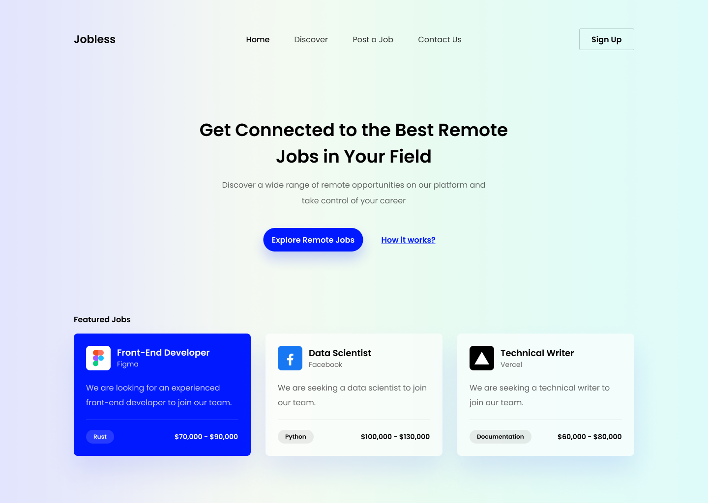
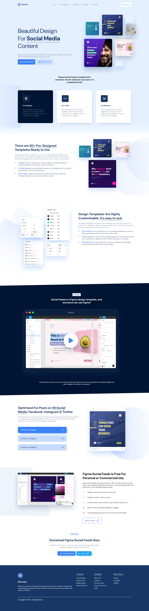

## Hasil Slicing Ui Design

Repository GitHub ini berisi hasil belajar saya dalam slicing UI dari **codedesign.dev**

## 1. Design Pertama(Belum Responsive)

## 2. Design kedua (Sudah Responsive)

## 3. Design Ketiga (Belum Responsive)

## 4. Design Keempat (Belum Responsive)

